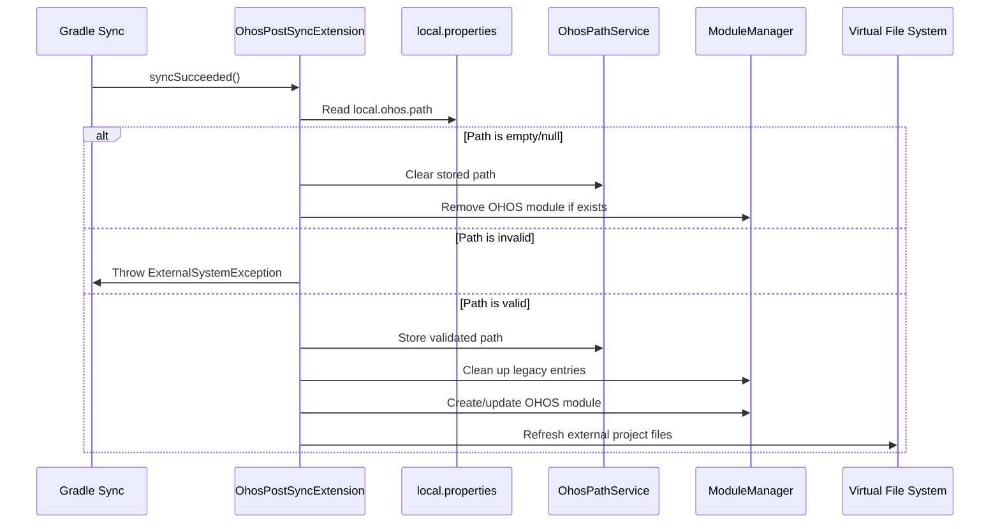

# Design Document: OHOS External Project Structure Fix

## Overview

This design addresses the structural issue where external OHOS projects are incorrectly added as Content Roots to the main module, resulting in a nested hierarchy. The solution creates a separate module for the external OHOS project that appears as a sibling to the main project in the Project View.

The key insight is that IntelliJ's module system naturally supports parallel modules within a single project window. By creating a dedicated module with its own content root (rather than adding the OHOS path as a content root to an existing module), we achieve the desired flat structure where both projects appear at the same hierarchical level.

## Architecture

### Current Implementation (Problematic)

```
Project
├── Main Module
│   ├── Content Root: /path/to/myProject
│   └── Content Root: /path/to/otherProject (OHOS) ← Problem: nested under main module
└── External Libraries
```

### Proposed Implementation

```
Project
├── Main Module
│   └── Content Root: /path/to/myProject
├── OHOS External Module
│   └── Content Root: /path/to/otherProject ← Solution: separate module
└── External Libraries
```

### Component Interaction Flow



## Components and Interfaces

### 1. OhosPostSyncExtension (Modified)

**Responsibility**: Orchestrates the post-sync workflow for OHOS path processing

**Key Methods**:

```kotlin
class OhosPostSyncExtension : GradleSyncListenerWithRoot {
    
    // Entry point called after successful Gradle sync
    override fun syncSucceeded(project: Project, rootProjectPath: String)
    
    // Main processing logic (runs on IO dispatcher)
    private fun processOhosPath(project: Project)
    
    // Creates or updates the OHOS module (runs on EDT with write action)
    private fun createOrUpdateOhosModule(project: Project, path: Path)
    
    // Removes legacy content roots and old modules
    private fun cleanupLegacyEntries(project: Project, moduleManager: ModuleManager)
    
    // Refreshes VFS for the external project
    private fun refreshVirtualFileSystem(path: Path)
}
```

**Threading Model**:
- `syncSucceeded()`: Called on Gradle sync thread
- `processOhosPath()`: Executes on IO dispatcher (Dispatchers.IO)
- `createOrUpdateOhosModule()`: Executes on EDT via `invokeLater` with `runWriteAction`
- `refreshVirtualFileSystem()`: Executes asynchronously

### 2. Module Creation Strategy

**Module Naming**: `OHOS-External-{projectName}`
- Prefix clearly identifies it as OHOS-related
- Project name suffix provides context
- Consistent naming enables idempotent operations

**Module Type**: `ModuleType.EMPTY`
- Does not trigger compilation
- Allows file browsing and navigation
- No SDK or build configuration required
- Prevents "Compilation is not supported" errors

**Module File Location**: `{projectBasePath}/.idea/modules/ohos-external-{projectName}.iml`
- Stored in `.idea/modules/` directory (standard IntelliJ location)
- Separate from main project modules
- Automatically managed by IntelliJ

### 3. Content Root Configuration

**Content Root Setup**:
```kotlin
val model = ModuleRootManager.getInstance(module).modifiableModel
val url = VfsUtil.pathToUrl(externalPath.toString())
val contentEntry = model.addContentEntry(url)

// Mark entire content root as excluded from compilation
contentEntry.addExcludeFolder(url)

model.commit()
```

**Exclusion Strategy**:
- Entire OHOS directory marked as excluded
- Prevents compilation attempts
- Allows navigation and file viewing
- No impact on main project build

### 4. Cleanup Strategy

**Legacy Entries to Remove**:

1. **Old Content Roots**: Any content entry in the main module pointing to OHOS paths
   - Identified by URL containing "OHOS" or matching the configured path
   - Removed before creating new module

2. **Old Modules**: Previously created OHOS modules with legacy names
   - Known legacy names: `z-OHOS-External`, `OHOS-External-Project`, `OHOS-External`
   - Removed using `ModifiableModuleModel.disposeModule()`

**Cleanup Sequence**:
```kotlin
// 1. Clean up old content roots from main module
val mainModule = moduleManager.modules.firstOrNull()
if (mainModule != null) {
    val rootModel = ModuleRootManager.getInstance(mainModule).modifiableModel
    val oldEntries = rootModel.contentEntries.filter { 
        it.url.contains("OHOS") || it.url == ohosUrl 
    }
    oldEntries.forEach { rootModel.removeContentEntry(it) }
    rootModel.commit()
}

// 2. Clean up old OHOS modules
val modifiableModel = moduleManager.getModifiableModel()
legacyModuleNames.forEach { name ->
    moduleManager.findModuleByName(name)?.let {
        modifiableModel.disposeModule(it)
    }
}
modifiableModel.commit()
```

### 5. Idempotent Module Management

**Module Reuse Logic**:
```kotlin
val moduleName = "OHOS-External-${project.name}"
val existingModule = moduleManager.findModuleByName(moduleName)

if (existingModule != null) {
    // Module exists - update its content root
    updateModuleContentRoot(existingModule, ohosPath)
} else {
    // Module doesn't exist - create new one
    createNewModule(moduleManager, moduleName, ohosPath)
}
```

**Path Change Handling**:
- When OHOS path changes, existing module's content root is updated
- Old content root removed, new one added
- Module name remains consistent

**Path Removal Handling**:
- When `local.ohos.path` is empty/removed, OHOS module is deleted
- Service path cleared
- Clean state restored

## Data Models

### OhosPathService (Unchanged)

```kotlin
@Service(Service.Level.PROJECT)
class OhosPathService {
    @Volatile
    var ohosPath: Path? = null
}
```

**State Transitions**:
- `null` → `Path`: OHOS path configured for first time
- `Path` → `Path`: OHOS path changed to different location
- `Path` → `null`: OHOS path removed/cleared
- `null` → `null`: No change (no OHOS configuration)

### Module Configuration Data

**Module Metadata**:
- Name: `OHOS-External-{projectName}`
- Type: `ModuleType.EMPTY`
- IML File: `.idea/modules/ohos-external-{projectName}.iml`
- Content Root: External OHOS project path
- Exclude Folders: Entire content root

## Correctness Properties

*A property is a characteristic or behavior that should hold true across all valid executions of a system—essentially, a formal statement about what the system should do. Properties serve as the bridge between human-readable specifications and machine-verifiable correctness guarantees.*


### Property Reflection

After analyzing all acceptance criteria, I identified several opportunities to consolidate redundant properties:

**Consolidations**:
1. Properties 2.2, 2.5, 3.1, and 3.3 all verify aspects of module configuration - these can be combined into a single comprehensive "Module Configuration Correctness" property
2. Properties 5.1 and 5.4 both test idempotency - these can be combined into a single "Idempotent Operations" property
3. Properties 4.1, 4.2, and 4.3 all test cleanup behavior - these can be combined into a single "Cleanup Completeness" property
4. Properties 8.1, 8.2, 8.3, 8.4, and 8.5 all test logging - these can be combined into a single "Logging Completeness" property

**Unique Properties Retained**:
- Path validation and storage (1.2, 1.3, 1.4)
- Module creation (2.1, 2.4)
- Module updates (5.2, 5.3)
- VFS refresh (6.1, 6.3)

This reduces 25 testable properties to 12 comprehensive properties that provide unique validation value.

### Correctness Properties

**Property 1: Empty Path Handling**
*For any* project state where the `local.ohos.path` is empty, null, or whitespace-only, processing the OHOS path should result in the OhosPathService being cleared (null) and no OHOS module existing in the project.
**Validates: Requirements 1.2**

**Property 2: Invalid Path Rejection**
*For any* non-existent file path configured as `local.ohos.path`, processing the OHOS path should throw an ExternalSystemException with a descriptive error message.
**Validates: Requirements 1.3**

**Property 3: Valid Path Storage**
*For any* valid existing directory path configured as `local.ohos.path`, processing the OHOS path should result in that path being stored in the OhosPathService.
**Validates: Requirements 1.4**

**Property 4: Module Creation for Valid Paths**
*For any* valid OHOS path configuration, processing should result in exactly one OHOS module being created in the project.
**Validates: Requirements 2.1**

**Property 5: Module Configuration Correctness**
*For any* created OHOS module, it should have: (1) a name matching the pattern `OHOS-External-{projectName}`, (2) module type set to EMPTY, (3) content root set to the configured OHOS path, and (4) the content root marked as excluded from compilation.
**Validates: Requirements 2.2, 2.5, 3.1, 3.3**

**Property 6: Module Independence**
*For any* created OHOS module, the main project module's content roots should not include the OHOS path.
**Validates: Requirements 2.4**

**Property 7: Cleanup Completeness**
*For any* OHOS path processing operation, all legacy content roots pointing to OHOS paths and all legacy OHOS modules should be removed before the new module is created.
**Validates: Requirements 4.1, 4.2, 4.3**

**Property 8: Idempotent Operations**
*For any* valid OHOS path, processing it multiple times should result in exactly one OHOS module with the correct configuration, regardless of how many times sync is triggered.
**Validates: Requirements 5.1, 5.4**

**Property 9: Module Update on Path Change**
*For any* existing OHOS module, when the configured path changes to a different valid path, the module's content root should be updated to the new path without creating a duplicate module.
**Validates: Requirements 5.2**

**Property 10: Module Removal on Path Clearing**
*For any* project with an existing OHOS module, when the `local.ohos.path` is cleared or removed, the OHOS module should be removed from the project.
**Validates: Requirements 5.3**

**Property 11: VFS Refresh Invocation**
*For any* OHOS module creation or update operation, the Virtual File System refresh should be invoked for the OHOS path with recursive flag enabled.
**Validates: Requirements 6.1, 6.3**

**Property 12: Logging Completeness**
*For any* OHOS path processing operation, appropriate log statements should be generated for: (1) path validation with the path value, (2) module operations with module name and operation type, (3) cleanup operations with removed entry details, (4) errors with full stack traces, and (5) all logs should use appropriate levels (info/warn/error).
**Validates: Requirements 8.1, 8.2, 8.3, 8.4, 8.5**

## Error Handling

### Error Categories

**1. Configuration Errors**
- **Invalid Path**: Path specified in `local.ohos.path` does not exist
  - Action: Throw `ExternalSystemException` with descriptive message
  - Message format: `"local.ohos.path 指定的路径不存在: {path}"`
  - User sees error in Gradle sync output

**2. File System Errors**
- **Properties File Missing**: `local.properties` file not found
  - Action: Log info message and return early (not an error)
  - Rationale: File is optional for projects without OHOS configuration

- **Properties File Read Error**: IOException while reading `local.properties`
  - Action: Log error with stack trace, skip OHOS processing
  - Rationale: Don't fail entire sync for OHOS-specific issue

**3. Module Management Errors**
- **Module Creation Failure**: Exception during module creation
  - Action: Log error with stack trace, don't propagate
  - Rationale: OHOS module is supplementary, shouldn't break main project

- **Module Update Failure**: Exception during content root update
  - Action: Log error with stack trace, leave existing module unchanged
  - Rationale: Better to have stale module than broken project state

**4. VFS Errors**
- **VFS Refresh Failure**: Exception during virtual file system refresh
  - Action: Log warning, continue (files will appear after manual refresh)
  - Rationale: Non-critical operation, user can manually refresh

### Error Recovery

**Graceful Degradation**:
- All errors in OHOS processing are contained and logged
- Main project functionality is never compromised
- User can fix configuration and re-sync to retry

**User Feedback**:
- Configuration errors shown in Gradle sync output
- Operational errors logged to IDE log (Help → Show Log)
- Clear error messages guide user to resolution

## Testing Strategy

### Dual Testing Approach

This feature requires both unit tests and property-based tests for comprehensive coverage:

**Unit Tests**: Focus on specific examples, integration points, and edge cases
- Example: Test with a specific known path like `/tmp/test-ohos-project`
- Example: Test cleanup with specific legacy module names
- Integration: Test interaction with ModuleManager and ModuleRootManager APIs
- Edge cases: Empty properties file, missing properties file, whitespace-only paths

**Property Tests**: Verify universal properties across all inputs
- Generate random valid directory paths and verify module creation
- Generate random invalid paths and verify error handling
- Generate random project names and verify module naming
- Test idempotency with random number of sync operations

**Property-Based Testing Configuration**:
- Framework: Kotest Property Testing (for Kotlin)
- Minimum iterations: 100 per property test
- Each property test must reference its design document property
- Tag format: `Feature: ohos-external-project-structure-fix, Property {number}: {property_text}`

### Test Organization

**Unit Test Structure**:
```kotlin
class OhosPostSyncExtensionTest {
    @Test
    fun `should create module for valid OHOS path`()
    
    @Test
    fun `should throw exception for non-existent path`()
    
    @Test
    fun `should clean up legacy content roots`()
    
    @Test
    fun `should handle empty local properties gracefully`()
}
```

**Property Test Structure**:
```kotlin
class OhosPostSyncExtensionPropertyTest {
    @Test
    fun `Property 1: Empty Path Handling`() = runTest {
        // Feature: ohos-external-project-structure-fix, Property 1: Empty Path Handling
        checkAll(100, Arb.emptyOrWhitespace()) { emptyPath ->
            // Test implementation
        }
    }
    
    @Test
    fun `Property 4: Module Creation for Valid Paths`() = runTest {
        // Feature: ohos-external-project-structure-fix, Property 4: Module Creation for Valid Paths
        checkAll(100, Arb.validDirectoryPath()) { validPath ->
            // Test implementation
        }
    }
}
```

### Test Coverage Goals

**Code Coverage**: Minimum 80% line coverage for OhosPostSyncExtension
**Property Coverage**: All 12 correctness properties implemented as property tests
**Edge Case Coverage**: All identified edge cases covered by unit tests
**Integration Coverage**: Module creation, update, and deletion flows tested end-to-end

### Testing Constraints

**Note**: Per user requirements, test implementation is excluded from this specification. The testing strategy is provided for documentation purposes, but no test code will be written as part of this feature implementation.

## Implementation Notes

### IntelliJ Platform APIs

**Key APIs Used**:
- `ModuleManager.getInstance(project)`: Access module management
- `ModuleManager.newModule(path, moduleTypeId)`: Create new module
- `ModuleManager.findModuleByName(name)`: Find existing module
- `ModifiableModuleModel`: Batch module operations
- `ModuleRootManager.getInstance(module)`: Access module content roots
- `ModifiableRootModel`: Modify module content roots
- `VfsUtil.pathToUrl(path)`: Convert file path to VFS URL
- `VfsUtil.findFile(path, refresh)`: Find and refresh VFS file

### Threading Considerations

**EDT (Event Dispatch Thread)**:
- All module creation/modification operations
- All write actions (runWriteAction)
- UI updates

**Background Thread (IO Dispatcher)**:
- Reading local.properties file
- Path validation (file system checks)
- Initial processing logic

**Async Operations**:
- VFS refresh (non-blocking)

### Module File Management

**IML File Location**: `.idea/modules/ohos-external-{projectName}.iml`
- Automatically created by IntelliJ
- Managed by ModuleManager
- Should not be manually edited
- Included in `.idea` directory (typically gitignored)

### Compatibility

**IntelliJ Platform Version**: 2023.1+
**Android Studio Version**: Compatible with Android Studio Hedgehog (2023.1.1) and later
**Gradle Version**: No specific requirements (uses Gradle sync hooks)
**Kotlin Version**: 1.9+ (for coroutines support)

## Future Enhancements

**Potential Improvements** (out of scope for this specification):

1. **Multi-Project Support**: Support multiple external OHOS projects
2. **Auto-Detection**: Automatically detect OHOS projects in workspace
3. **UI Configuration**: Settings panel for OHOS path configuration
4. **Dependency Management**: Automatically configure dependencies between main and OHOS projects
5. **Build Integration**: Optional build integration for OHOS projects
6. **Project Templates**: Quick-start templates for OHOS projects

## References

- [IntelliJ Platform SDK - Module](https://plugins.jetbrains.com/docs/intellij/module.html)
- [IntelliJ Platform SDK - Project Structure](https://plugins.jetbrains.com/docs/intellij/project-structure.html)
- [IntelliJ Platform SDK - Threading](https://plugins.jetbrains.com/docs/intellij/general-threading-rules.html)
- [Gradle Sync Listener API](https://developer.android.com/studio/build/gradle-plugin-api)
